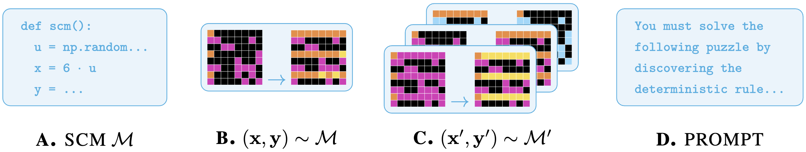

# CausalARC: Abstract Reasoning with Causal World Models

**Abstract**

>Reasoning requires adaptation to novel problem settings under limited data and distribution shift. This work introduces CausalARC: an experimental testbed for AI reasoning in low-data and out-of-distribution regimes, modeled after the Abstraction and Reasoning Corpus (ARC). Each CausalARC reasoning task is sampled from a fully specified *causal world model*, formally expressed as a structural causal model. Principled data augmentations provide observational, interventional,  and counterfactual feedback about the world model in the form of few-shot, in-context learning demonstrations. As a proof-of-concept, we illustrate the use of CausalARC for four language model evaluation settings: (1) abstract reasoning with test-time training, (2) counterfactual reasoning with in-context learning, (3) program synthesis, and (4) causal discovery with logical reasoning. 

<br>
<p align="center">
    <br>
    <i>The CausalARC testbed for reasoning evaluation.</i>
</p>
<br>

**Coming soon: At camera-ready, this anonymous repository will be replaced with a public project page hosted on GitHub pages. Documentation will be provided for easy usage with little overhead. Datasets will be hosted on Hugging Face.**

## Respository structure

```bash
.
├── causal_arc # All source code for CausalARC (task generation, data processing, etc).
│   ├── carc_augment.py
│   ├── carc_tasks_counting.py
│   ├── carc_tasks_extension.py
│   ├── carc_tasks_logical.py
│   ├── carc_tasks_order.py
│   ├── carc_utils.py
│   └── carc.py
├── data
│   ├── prompts # Prompt dictionaries submitted to LLMs for langchain experiments.
│   │   ├── causal_discovery
│   │   │   └── discovery_logical_compose_and_xor_prompts.json
│   │   ├── counterfactual_reasoning
│   │   │   ├── counting_extension_ordering
│   │   │   │   └── cf_reasoning_counting_extension_ordering_prompts.json
│   │   │   └── logical
│   │   │       └── cf_reasoning_logical_prompts.json
│   │   └── program_synthesis
│   │       ├── program_synthesis_nexamples4_prompts.json
│   │       ├── program_synthesis_nexamples6_prompts.json
│   │       └── program_synthesis_nexamples8_prompts.json
│   └── static_evaluation_set # The version of the static dataset used in MARC TTT experiments.
│       └── v0_09-01-25
│           ├── counting
│           │   ├── causal_arc_counting_solutions.json
│           │   └── causal_arc_counting.json
│           ├── extension
│           │   ├── causal_arc_extension_solutions.json
│           │   └── causal_arc_extension.json
│           ├── logical
│           │   ├── causal_arc_logical_alternate.json
│           │   ├── causal_arc_logical_and.json
│           │   ├── causal_arc_logical_compose.json
│           │   ├── causal_arc_logical_or.json
│           │   ├── causal_arc_logical_solutions.json
│           │   └── causal_arc_logical_xor.json
│           └── ordering
│               ├── causal_arc_ordering_solutions.json
│               └── causal_arc_ordering.json
├── demos # Jupyter notebooks coming soon.
├── experiments
│   └── marc_results # Raw output dictionaries from MARC TTT experiments.
└── README.md
```
