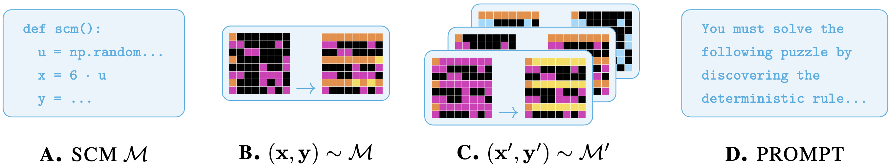

# CausalARC: Abstract Reasoning with Causal World Models

Spotlight Paper ★ NeurIPS 2025 Workshop: [Bridging Language, Agent, and World Models for Reasoning and Planning (LAW)](https://sites.google.com/view/law-2025/home?authuser=0)

Please cite this work:
```
@inproceedings{maasch2025causalarc,
   title={CausalARC: Abstract Reasoning with Causal World Models},
   author={Maasch, Jacqueline and Kalantari, John and Khezeli, Kia},
   booktitle={NeurIPS 2025 Workshop on Bridging Language, Agent, and World Models for Reasoning and Planning}
}
```

This repository houses the source code for generating CausalARC tasks, as well as static datasets of presampled tasks (`data/static_evaluation_set/`) and text prompts (`data/prompts/`).

See our full project page here: [https://jmaasch.github.io/carc/](https://jmaasch.github.io/carc/)


**Abstract**

>On-the-fly reasoning often requires adaptation to novel problems under limited data and distribution shift. This work introduces CausalARC: an experimental testbed for AI reasoning in low-data and out-of-distribution regimes, modeled after the [Abstraction and Reasoning Corpus](https://arcprize.org/) (ARC). Each CausalARC reasoning task is sampled from a fully specified *causal world model*, formally expressed as a structural causal model (SCM). Principled data augmentations provide observational, interventional, and counterfactual feedback about the world model in the form of few-shot, in-context learning demonstrations. As a proof-of-concept, we illustrate the use of CausalARC for four language model evaluation settings: (1) abstract reasoning with test-time training, (2) counterfactual reasoning with in-context learning, (3) program synthesis, and (4) causal discovery with logical reasoning. Within- and between-model performance varied heavily across tasks, indicating room for significant improvement in language model reasoning.

<br>
<p align="center">
    <br>
    <i>The CausalARC testbed for reasoning evaluation.</i>
</p>
<br>

## Respository structure

```bash
.
├── causal_arc # All source code for CausalARC (task generation, data processing, etc).
│   ├── carc_augment.py
│   ├── carc_tasks_counting.py
│   ├── carc_tasks_extension.py
│   ├── carc_tasks_logical.py
│   ├── carc_tasks_order.py
│   ├── carc_utils.py
│   └── carc.py
├── data
│   ├── prompts # Prompt dictionaries submitted to LLMs for langchain experiments.
│   │   ├── causal_discovery
│   │   │   └── discovery_logical_compose_and_xor_prompts.json
│   │   ├── counterfactual_reasoning
│   │   │   ├── counting_extension_ordering
│   │   │   │   └── cf_reasoning_counting_extension_ordering_prompts.json
│   │   │   └── logical
│   │   │       └── cf_reasoning_logical_prompts.json
│   │   └── program_synthesis
│   │       ├── program_synthesis_nexamples4_prompts.json
│   │       ├── program_synthesis_nexamples6_prompts.json
│   │       └── program_synthesis_nexamples8_prompts.json
│   └── static_evaluation_set # The version of the static dataset used in MARC TTT experiments.
│       └── v0_09-01-25
│           ├── counting
│           │   ├── causal_arc_counting_solutions.json
│           │   └── causal_arc_counting.json
│           ├── extension
│           │   ├── causal_arc_extension_solutions.json
│           │   └── causal_arc_extension.json
│           ├── logical
│           │   ├── causal_arc_logical_solutions.json
│           │   └── causal_arc_logical.json
│           └── ordering
│               ├── causal_arc_ordering_solutions.json
│               └── causal_arc_ordering.json
├── demos
│   ├── causal_discovery_pc_algorithm.ipynb # Run PC algorithm on a CausalARC SCM.
│   ├── preview_causal_arc_tasks.ipynb # View examples from all CausalARC SCMs.
│   ├── prompt_generation # Directory for demonstrations of prompt sampling functions.
│   │   ├── prompt_causal_discovery_logical_composition.ipynb
│   │   ├── prompt_counterfactual_counting_ordering_extension.ipynb
│   │   └── prompt_program_synthesis.ipynb
│   └── task_sampling # Directory for demonstrations of task / grid sampling functions.
│       ├── causal_arc_task_construction_counting.ipynb
│       ├── causal_arc_task_construction_extension.ipynb
│       ├── causal_arc_task_construction_logical.ipynb
│       └── causal_arc_task_construction_ordering.ipynb
├── experiments
│   ├── langchain # Directory for langchain scripts to query proprietary models.
│   └── marc_results # Directory for raw output dictionaries from MARC TTT experiments.
└── README.md
```
